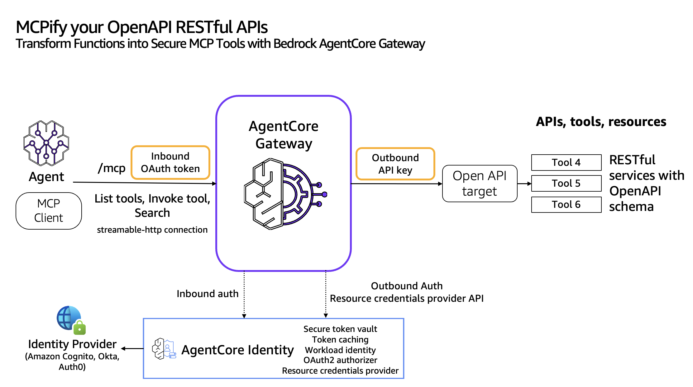

# OpenAPI to MCP Tools with Amazon Bedrock AgentCore
#### Using the NASA Mars Weather API as an example

The Amazon Bedrock AgentCore Gateway ( in Preview ) can transform existing REST APIs defined in OpenAPI specifications  into Model Context Protocol (MCP) tools. This transformation allows AI agents to interact with external services through a unified, standardized interface without requiring custom integration code.

The Gateway acts as a translation layer that not only converts OpenAPI specifications into MCP-compatible tools, handling authentication, request routing, and protocol conversion automatically.

This cdk app demonstrates a CDK-based solution that transforms the NASA Mars Weather API into MCP (Model Context Protocol) tools using AWS Bedrock AgentCore Gateway. While It's based a TypeScript CDK implementation of the tutorial found at in the [awslabs tutorials](https://github.com/awslabs/amazon-bedrock-agentcore-samples/blob/main/01-tutorials/02-AgentCore-gateway/02-transform-apis-into-mcp-tools/01-transform-openapi-into-mcp-tools/01-openapis-into-mcp-api-key.ipynb)

While the example is a trivial public API, this project uses a contruct that can be used for any openapi spec document, providing you with the ability to create MPC tools extremly quicky with minimal effort. 

## Why is this Important?
Modern enterprises rely on hundreds of REST APIs for their daily operations, but integrating these APIs with AI agents historicaly requires custom integration code, manual protocol conversion, and complex authentication management. 

Using AgentCore Gateway fundamentally transforms this by automating API integration through OpenAPI specification parsing, standardizing access via the MCP protocol, and centralizing authentication management.


## What it does

The [`nasa.ts`](./src/mcps/nasa.ts)
 CDK stack creates:

- **Bedrock AgentCore Gateway** - Transforms REST APIs into MCP tools
- **Cognito Authentication** - OAuth 2.0 client credentials flow for secure access
- **S3 Storage** - Hosts the OpenAPI specification for the NASA API
- **API Key Management** - Securely stores NASA API keys in AWS Secrets Manager
- **Custom Resources** - Lambda functions to manage Bedrock AgentCore resources

## Architecture




## Key Components

[AgentCoreOpenAPI CDK Construct](https://github.com/raindancers/raindancers-cdk/blob/main/src/agentCore/agentCoreOpenAPI.ts). This published as part of the [raindancers-cdk construct](https://www.npmjs.com/package/raindancers-cdk)

The reusable CDK construct creates:
- Cognito User Pool with OAuth 2.0 client credentials
- S3 bucket for OpenAPI specifications
- Custom resources for gateway, credential provider, and target management.   At the time of writing this, Cloudformation coverage for these resources does not exisit
- IAM roles with proper trust policies for Bedrock AgentCore

### WeatherOnMars Stack (`src/mcps/nasa.ts`)
Implements the NASA Mars Weather API gateway:
- Uses the AgentCoreOpenAPI construct
- Configures NASA API key from Secrets Manager
- Deploys OpenAPI spec for NASA InSight weather data

## Usage ( This assumes a knowledge of CDK and General AWS Use )

1. Get a API Token from api.nasa.gov. Store the the token in a json formed aws secret, Key 'nasa' in the region/account you will use.  Get the Arn for the secret, and insert the arb on line 24.  This means the token is not recorded in clear text.

1. **Deploy the stack:** 

   How you deploy the stack will vary somewhat depending on how you use cdk
   
   ```bash
   npx cdk deploy mpcOverAPI-WeatherOnMars
   ```

2. **Get connection values from outputs:**
   - `GatewayUrl` - MCP gateway endpoint
   - `UserPoolId` - Cognito user pool ID
   - `UserPoolClientId` - OAuth client ID
   - `CognitoDomain` - Domain for token requests
   - `TargetName` - Target name for MCP calls
   - `ScopeString` - OAuth scopes

3. **Connect from your agent** or use the test.py client  ( warning this agent is a bit ugly )

   a. Copy details above into lines 25-30 of test.py
   b. As written the test client, assumes that there is a aws profile called 'sandpit'. You may want to modify this as you see need. ( line 12 ). This profile needs to have appropriate permissions. 
   c. remember to instasll the requirements.txt

   (Note what are the permissions.) 


## Benefits over Manual Implementation

- **Infrastructure as Code** - Reproducible, version-controlled deployments
- **Automatic Cleanup** - Resources delete cleanly when stack is destroyed
- **Parameterized** - Reusable across different APIs and environments
- **Security** - Proper IAM roles, secret management, and OAuth flows
- **Monitoring** - CloudWatch logs and error handling built-in

## Cost Estimate

For 1,000 requests/day:
- **Bedrock Model Usage**: ~$150-300/month (Claude Sonnet 4)
- **AgentCore Gateway**: ~$30-60/month
- **Supporting Infrastructure**: ~$2-5/month
- **Total**: ~$180-365/month
